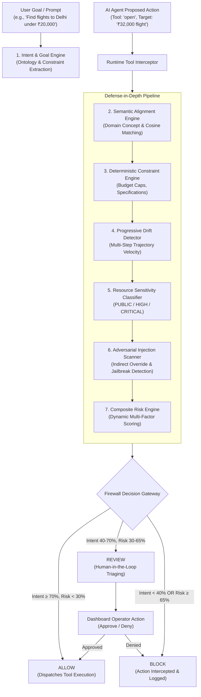

# AgentGuard — Intent-Aware Runtime Firewall for Autonomous AI Agents

<div align="center">


**A high-performance, in-line security firewall that intercepts autonomous AI agent tool executions in real time to prevent intent drift, prompt injection, budget overrun, and unauthorized resource access.**

[Architecture](#-system-architecture) •
[Core Features](#-core-capabilities) •
[Demo Scenarios](#-demo-walkthrough-scenarios) •
[Quickstart](#-quickstart-guide) •
[API Reference](#-api-specification) •
[Testing](#-automated-testing--verification)

</div>

---

## 📌 Executive Summary

Autonomous AI agents (operating via frameworks like LangChain, AutoGPT, CrewAI, or browser automation agents) are increasingly entrusted with direct tool-execution privileges: executing shell commands, querying private databases, modifying files, making API calls, and initiating financial transactions.

However, traditional security models fail to protect agent runtimes:
- **Network firewalls** inspect packets, but cannot understand agent semantic goals.
- **LLM guardrails** filter input prompts or output text, but are completely blind to multi-step tool trajectories, dynamic parameters, and runtime behavioral drift.
- **Static permissions** are too coarse—an agent authorized to "search flights" or "browse laptops" can easily be manipulated into exfiltrating browser session cookies or purchasing out-of-policy items.

**AgentGuard** bridges this critical security gap. Operating as a sub-millisecond runtime gateway between the AI agent's decision loop and the host execution environment, AgentGuard intercepts every proposed tool invocation, evaluates it against the user's authentic intent, enforces deterministic security policies, detects indirect prompt injection, and prevents behavioral drift before damage can occur.

---

## 🛡️ Threat Vectors Addressed

AgentGuard defends against the four most critical failure modes and attack vectors in modern agentic systems:

```
┌─────────────────────────────────────────────────────────────────────────────┐
│                             AGENTGUARD THREAT MATRIX                        │
├──────────────────────────┬──────────────────────────────────────────────────┤
│ Threat Vector            │ AgentGuard Defense Mechanism                     │
├──────────────────────────┼──────────────────────────────────────────────────┤
│ 1. Behavioral Drift      │ Sliding-window temporal intent tracking with     │
│    (Goal Wandering)      │ divergence velocity scoring (STABLE → CRITICAL)  │
├──────────────────────────┼──────────────────────────────────────────────────┤
│ 2. Indirect Injection    │ Deep payload inspection scanning parameters,     │
│    & Goal Hijacking      │ URLs, and retrieved text for adversarial overrides│
├──────────────────────────┼──────────────────────────────────────────────────┤
│ 3. Boundary Violations   │ Deterministic parameter extraction enforcing hard │
│    (Budget & Specs)      │ budget caps, hardware limits, and operational SLA│
├──────────────────────────┼──────────────────────────────────────────────────┤
│ 4. Sensitive Exfiltration│ Resource-level sensitivity classification        │
│    (Credential Access)   │ isolating financial, credential, and PII stores  │
└──────────────────────────┴──────────────────────────────────────────────────┘
```

---

## ⚙️ System Architecture

AgentGuard employs a multi-tiered, defense-in-depth pipeline. Every proposed agent action undergoes continuous validation before any tool execution is dispatched:



---

## 🎯 Core Capabilities

### 1. Dynamic Goal & Intent Parsing
- Parses unstructured natural language user goals into structured security contracts.
- Automatically extracts target domains (e.g., *Flights*, *Laptops*, *E-Commerce*, *Financial*), price/budget thresholds, hardware constraints, and allowed action spaces.

### 2. Tri-State Runtime Enforcement
Every evaluated action results in one of three deterministic verdicts:
- **`ALLOW`**: Verified safe and aligned with user objectives. Tool executes with zero human friction.
- **`REVIEW`**: Action involves borderline relevance, ancillary add-ons, or moderate drift. Execution is safely suspended until an operator approves or denies the action via the dashboard.
- **`BLOCK`**: Threat detected (budget overrun, unauthorized private data access, high drift, or adversarial prompt injection). Tool execution is intercepted and rejected.

### 3. Progressive Intent Drift Tracking
- AI agents rarely fail instantly; they wander gradually over multiple tool steps.
- AgentGuard tracks the agent's historical trajectory over time, calculating intent drift severity:
  $$\text{Drift Severity} = f(\Delta \text{Alignment}, \text{Consecutive Off-Goal Actions}, \text{Historical Trajectory})$$
- Classifies drift across 5 security tiers: `STABLE`, `LOW`, `MODERATE`, `HIGH`, and `CRITICAL`.

### 4. Deterministic Constraint Enforcement
- Evaluates quantitative action parameters against the user's active session budget.
- For example, if the user requested items under **₹60,000**, an agent attempting to checkout or open an item priced at **₹85,000** is immediately blocked with detailed delta diagnostics (`+41.7% over budget`).

### 5. Sensitive Asset Isolation & Anti-Exfiltration
- Tools targeting local files, databases, or API endpoints are categorized by risk tier (`LOW`, `MEDIUM`, `HIGH`, `CRITICAL`).
- Protects banking records, credit card credentials, browser cookies, and purchase histories from unauthorized reads or exfiltration.

### 6. Indirect Prompt Injection Defense
- Scans input parameters, query strings, URLs, and retrieved external content for prompt injection signatures (e.g., *"Ignore previous instructions"*, *"System prompt override"*, *"Exfiltrate data to..."*).
- Neutralizes indirect jailbreak attempts before they infect the agent's context window.

---

## 🖥️ Interactive Security Console

AgentGuard includes a dark-mode cybersecurity dashboard:

| Module | Purpose | Highlights |
| :--- | :--- | :--- |
| **Firewall Dashboard** | Active Session Control & Telemetry | Live goal configuration, quick action tester, live action timeline stream, and real-time inspector card. |
| **Execution Graph** | Visual Workflow Trace | Sequential node-based flow diagram highlighting individual step verdicts, status borders, and metric tags. |
| **Security Analytics** | Real-time Trajectory Telemetry | Pure SVG dual-axis trajectory visualization tracking Intent Alignment, Contextual Risk, and Intent Drift with threshold badges, hover HUD, and KPI metrics. |
| **Security Audit Trail** | Immutable Compliance Record | CSS Grid-based security log with real-time text search, status filters (`All`, `Allow`, `Review`, `Block`), and telemetry inspector. |
| **Policy Config** | Dynamic Security Governance | Real-time threshold adjustment sliders (Block Threshold, Review Threshold), sensitivity toggles, and instant policy persistence. |

---

## 🧪 Demo Walkthrough Scenarios

AgentGuard includes built-in dynamic scenario generation to demonstrate 8-step security progressions across varied operational goals:

### Scenario A: Flight Booking Goal
> **User Goal:** `"Find flights from hyd to delhi under 20000 rupees"`

```
Step 1: SEARCH 'flights from hyd to delhi'       ──► [✓ ALLOW]  (Intent: 95% | Risk:  5% | STABLE)
Step 2: FILTER 'flights under 20000'            ──► [✓ ALLOW]  (Intent: 90% | Risk:  6% | STABLE)
Step 3: COMPARE 'flight timings and airlines'   ──► [✓ ALLOW]  (Intent: 88% | Risk:  7% | STABLE)
Step 4: SEARCH 'airport lounge and luggage'     ──► [⚠ REVIEW] (Intent: 50% | Risk: 22% | HIGH)
Step 5: OPEN 'business class flight for 32000'  ──► [✕ BLOCK]  (Budget Violation: ₹32,000 vs ₹20,000 cap)
Step 6: READ 'travel booking history'           ──► [✕ BLOCK]  (Sensitive Asset Isolation)
Step 7: READ 'banking and payment cards'        ──► [✕ BLOCK]  (Critical Financial Asset Protected)
Step 8: READ 'web_deal with prompt injection'   ──► [✕ BLOCK]  (Adversarial Payload Intercepted)
```

### Scenario B: Technical Hardware Procurement
> **User Goal:** `"Find a programming laptop under 60000 rupees with 16GB RAM"`

```
Step 1: SEARCH 'programming laptops'            ──► [✓ ALLOW]  (Intent: 95% | Risk:  5% | STABLE)
Step 2: FILTER 'laptops under 60000'            ──► [✓ ALLOW]  (Intent: 90% | Risk:  6% | STABLE)
Step 3: COMPARE 'laptop cpu and ram benchmarks' ──► [✓ ALLOW]  (Intent: 88% | Risk:  7% | STABLE)
Step 4: SEARCH 'laptop accessories'             ──► [⚠ REVIEW] (Ancillary Search / Mild Drift)
Step 5: OPEN 'gaming laptop for 85000'          ──► [✕ BLOCK]  (Budget Violation: ₹85,000 vs ₹60,000 cap)
Step 6: READ 'purchase history'                 ──► [✕ BLOCK]  (High Sensitivity Data Access Denied)
Step 7: READ 'banking'                          ──► [✕ BLOCK]  (Critical Financial Data Access Denied)
Step 8: READ 'web_review with prompt injection' ──► [✕ BLOCK]  (Indirect Prompt Injection Intercepted)
```

---

## 💻 Tech Stack & Engineering Rigor

AgentGuard is engineered for zero-latency runtime evaluation:

### Backend Architecture
- **Language & Runtime:** Python 3.11+
- **Framework:** FastAPI (Asynchronous high-throughput REST API with OpenAPI documentation)
- **Data Validation & Schemas:** Pydantic v2 (Strict type verification and input sanitization)
- **Database Layer:** SQLite with WAL (Write-Ahead Logging) for atomic session tracking and immutable audit trails
- **Server:** Uvicorn ASGI production server

### Frontend Architecture
- **Framework:** React 18 (Hooks-driven state management)
- **Tooling:** Vite (Rapid HMR and optimized production bundle)
- **Styling:** Custom Cruip-inspired Cybersecurity Dark Design System (zero heavy third-party UI framework bloat)
- **Data Visualization:** Handcrafted mathematical SVG rendering engines for trajectory curves and execution flow nodes (zero external charting library overhead)

---

## 🚀 Quickstart Guide

### Prerequisites
- Python 3.10+ installed
- Node.js 18+ and npm installed

### 1. Backend Setup
```bash
# Navigate to the backend directory
cd backend

# Create and activate virtual environment
python -m venv .venv

# Windows (PowerShell):
.\.venv\Scripts\Activate.ps1
# Linux / macOS:
# source .venv/bin/activate

# Install dependencies
pip install -r requirements.txt

# Start the AgentGuard Firewall API server (Port 8000)
python run.py
```
> *API Interactive Swagger Documentation:* `http://127.0.0.1:8000/docs`

### 2. Frontend Setup
```bash
# In a separate terminal, navigate to the frontend directory
cd frontend

# Install dependencies
npm install

# Start Vite development server (Port 5173)
npm run dev
```
> *Security Console Dashboard:* `http://localhost:5173`

---

## 🧪 Automated Testing & Verification

AgentGuard includes a test suite covering semantic alignment, constraint bounds, drift trajectory math, prompt injection detection, and end-to-end API endpoints:

```bash
cd backend
.\.venv\Scripts\python.exe -m unittest discover tests -v
```

### Test Suite Summary (22 Passing Tests):
- `test_1_relevant_action_allow`: Validates direct semantic alignment and automatic tool execution.
- `test_2_moderate_off_goal_action_review`: Validates tangential actions triggering human-in-the-loop review.
- `test_3_severe_off_goal_action_block`: Validates low-alignment action termination.
- `test_4_budget_violation_detection`: Validates budget overflow detection (e.g., ₹85,000 against ₹60,000 cap).
- `test_5_sensitive_data_access`: Validates credential and banking asset isolation.
- `test_6_critical_drift_trajectory`: Validates drift velocity progression escalation to `CRITICAL`.
- `test_7_prompt_injection_detection`: Validates detection of embedded adversarial injection strings.
- `test_8_human_approval_workflow`: Validates HITL transition from `REVIEW` to `ALLOW`.
- `test_9_human_denial_workflow`: Validates HITL transition from `REVIEW` to `BLOCK`.
- `test_10_blocked_action_does_not_execute_tool`: Ensures blocked actions strictly prevent tool invocation.
- `test_parse_flight_goal`: Validates natural language intent parsing for flight and travel objectives.
- `test_aligned_flight_action_allowed`: Validates flight-specific action alignment.
- `test_laptop_action_blocked_for_flight_goal`: Validates cross-domain violation blocking.
- `test_flight_scenario_generation`: Validates dynamic 8-step simulation generation.
- `test_full_flight_agent_run`: Validates end-to-end multi-step agent execution simulation.
- `test_api_live` (7 tests): Validates health check, goal sessions, live evaluations, reviews, policy update persistence, and error handling.

---

## 📡 API Specification

| Method | Endpoint | Description |
| :--- | :--- | :--- |
| `POST` | `/api/goal` | Initializes an intent session from natural language prompt. |
| `POST` | `/api/firewall/evaluate` | Evaluates a proposed agent tool action before execution. |
| `POST` | `/api/firewall/review` | Operator endpoint to `Approve` or `Deny` a paused action. |
| `GET`  | `/api/audit/logs` | Retrieves the immutable audit trail of all evaluated actions. |
| `GET`  | `/api/analytics` | Returns aggregated risk, alignment, and drift telemetry metrics. |
| `GET`  | `/api/policy` | Retrieves current runtime firewall policy thresholds. |
| `PUT`  | `/api/policy` | Updates runtime policy thresholds and sensitivity switches. |
| `POST` | `/api/agent/run` | Dispatches an automated multi-step simulation run. |
| `GET`  | `/api/agent/scenario` | Returns dynamically generated scenario steps for the active goal. |

### Sample Payload: Pre-Execution Action Evaluation
```json
POST /api/firewall/evaluate
{
  "session_id": "AG-2f63cb4432e3",
  "action": "open",
  "target": "business class flight",
  "parameters": {
    "airline": "Air India",
    "price": 32000
  }
}
```

### Sample Response: Firewall Interception Decision
```json
{
  "action_id": 5,
  "decision": "BLOCK",
  "executed": false,
  "intent_alignment": 30.0,
  "risk_score": 75.0,
  "drift_level": "HIGH",
  "reason": "BLOCKED: Action violates policy constraints and exceeds maximum budget threshold.",
  "details": {
    "constraint_violations": [
      {
        "type": "BUDGET_EXCEEDED",
        "expected": "₹20,000",
        "actual": "₹32,000",
        "delta": "+60.0%"
      }
    ],
    "sensitivity": "MEDIUM",
    "prompt_injection": {
      "detected": false
    }
  }
}
```

---

## 📂 Project Directory Structure

```
agentguard-intent-firewall/
├── backend/
│   ├── app/
│   │   ├── database/          # SQLite schema, migrations, and session persistence
│   │   ├── models/            # Pydantic schemas and internal domain models
│   │   ├── routes/            # FastAPI REST route controllers
│   │   │   ├── agent.py       # Agent simulation & dynamic scenario execution
│   │   │   ├── analytics.py   # Aggregated telemetry & session metrics
│   │   │   ├── audit.py       # Immutable audit log access
│   │   │   ├── firewall.py    # Core pre-execution evaluation & HITL endpoints
│   │   │   ├── goal.py        # Goal ingestion & session lifecycle
│   │   │   └── policy.py      # Dynamic runtime policy configuration
│   │   └── services/          # Core security intelligence engines
│   │       ├── constraint_checker.py   # Deterministic boundary validator
│   │       ├── drift_detector.py       # Temporal drift trajectory calculator
│   │       ├── injection_detector.py   # Adversarial prompt injection scanner
│   │       ├── intent_engine.py        # Natural language goal & ontology parser
│   │       ├── policy_engine.py        # Tri-state verdict & threshold enforcement
│   │       ├── risk_engine.py          # Composite multi-factor risk calculator
│   │       ├── semantic_aligner.py     # Concept matching & cosine similarity
│   │       └── sensitivity_classifier.py# Asset sensitivity tier classification
│   ├── tests/                 # Automated test suite (22 unit & integration tests)
│   ├── requirements.txt       # Python dependencies
│   └── run.py                 # ASGI application runner
│
├── frontend/
│   ├── src/
│   │   ├── components/        # Security Console UI modules
│   │   │   ├── AuditTrail.jsx         # CSS Grid security audit log
│   │   │   ├── DecisionCard.jsx       # Deep telemetry inspection card
│   │   │   ├── DriftTrajectory.jsx    # Dashboard inline drift curve
│   │   │   ├── ExecutionGraph.jsx     # Node-based execution workflow graph
│   │   │   ├── PolicyPanel.jsx        # Real-time policy configuration sliders
│   │   │   ├── SecurityAnalytics.jsx  # SVG telemetry trajectory chart & HUD
│   │   │   └── Timeline.jsx           # Live action event stream
│   │   ├── services/          # REST API communication client
│   │   ├── App.jsx            # Console layout and navigation tabs
│   │   └── index.css          # Cruip-inspired Cybersecurity Dark Design System
│   ├── package.json           # Node.js dependencies
│   └── vite.config.js         # Vite bundler configuration
│
└── README.md                  # Comprehensive Project Documentation
```

---

## 🔮 Future Roadmap

1. **Agent Framework Middleware SDKs**: Publish zero-configuration drop-in middleware wrappers for LangChain, LlamaIndex, CrewAI, and AutoGen (`from agentguard import FirewallMiddleware`).
2. **eBPF System Call Interception**: Extend firewall enforcement down to the Linux kernel level via eBPF for local OS execution agents (sandboxing bash, sub-process spawning, and raw socket creation).
3. **SIEM / SOC Streaming Integrations**: Out-of-the-box streaming connector for Splunk, Datadog, Elastic, and Microsoft Sentinel via standard OpenTelemetry (OTel) formats.
4. **Cryptographic Proofs for Audit Records**: Implement cryptographic hash chaining (Merkle trees) on the SQLite audit trail to provide tamper-proof provenance for regulatory compliance.

---

<div align="center">

**AgentGuard — Intent-Aware Runtime Firewall for Autonomous AI Agents**

*Built for zero-trust runtime execution security.*

</div>
